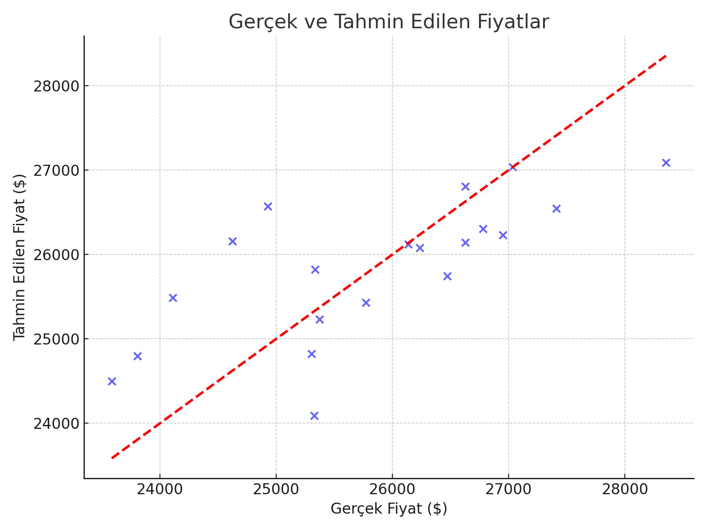
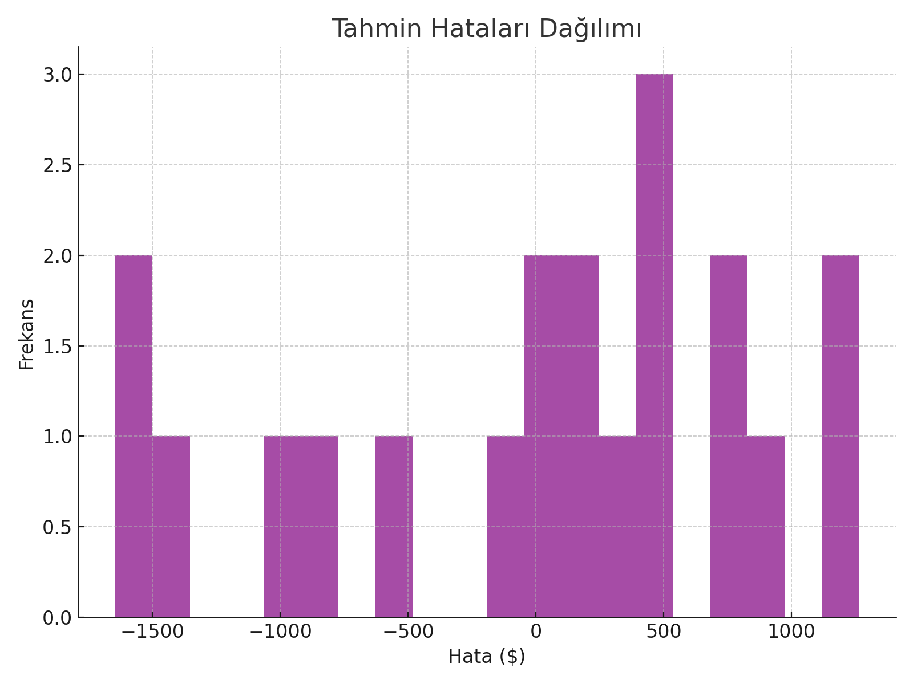
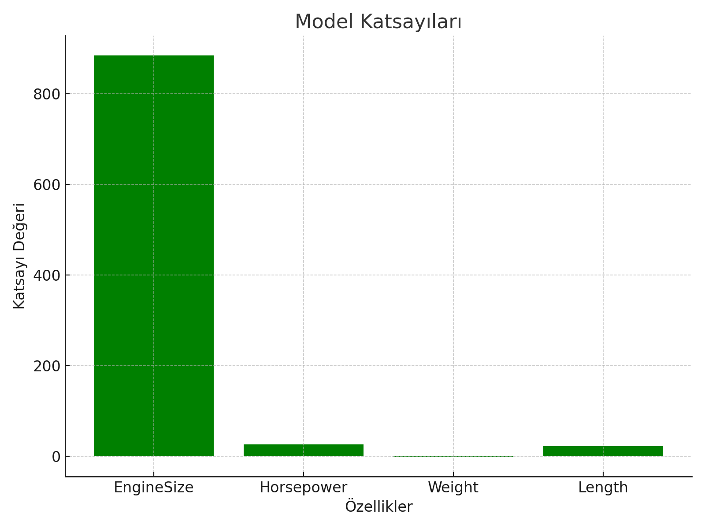

# 🚗 Araç Fiyat Tahmin Projesi

Bu proje, araç verilerini kullanarak fiyat tahmini yapmaktadır. Model, **Linear Regression** algoritması ile eğitilmiş ve bir kullanıcı arayüzü (GUI) ile tahminler kolayca yapılabilmektedir.

## 🎯 Amaç
Araçların motor gücü, ağırlığı, uzunluğu gibi teknik verilerini kullanarak fiyat tahmini yapmak ve veriyi analiz ederek öngörülerde bulunmak.

## 📊 Kullanılan Kütüphaneler
- pandas
- scikit-learn
- numpy
- joblib
- tkinter (arayüz için)
## 📊 Sonuç Görselleri





## ⚙️ Kurulum
Projeyi klonlayarak başlayabilirsin:
```bash
git clone https://github.com/ibrahim-safak/car_price_prediction.git
cd car_price_prediction
pip install -r requirements.txt
